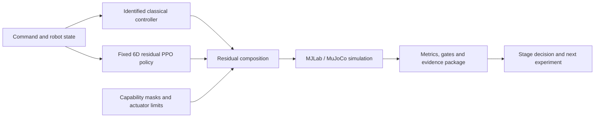

# Hybrid Residual Control for a Wheel-Legged Robot

Undergraduate Research Practice (FURP) - Faculty of Science and Engineering - University of Nottingham Ningbo China

This project studies wheel-legged robot control in MJLab/MuJoCo. The current Hybrid v2 architecture combines an identified classical wheel-balance controller with a fixed six-dimensional residual PPO policy. Capability masks and actuator limits keep the learned residual bounded while staged evaluation separates controller faults from policy-learning outcomes.

## Architecture



## Current Status

- Formally validated simulation-based GPU yaw calibration across 14 commanded non-zero yaw states with zero task terminations.
- Completed two seed-1 residual-PPO stair campaigns of 1,000 updates each; the reward-rebalanced campaign used 256 parallel environments.
- Reward redesign changed policy behavior and increased use of the permitted leg residuals, but all 20 curriculum evaluations retained zero promotion.
- The current scientific conclusion is therefore a bounded negative result: objective redesign changed behavior without demonstrating curriculum advancement or stair capability.

## My Contribution

- Define research questions, Hybrid v2 architecture choices and staged experiment routes.
- Design and execute controlled experiments, diagnose failure modes and decide which evidence supports promotion, tuning or stopping.
- Develop, review and integrate tooling for identification, calibration, task gating, evaluation and provenance with collaborative and AI-assisted implementation.
- Maintain conservative claim boundaries between implementation, diagnostic observations and qualified experiment results.

## Verified Results

- A frozen simulation yaw-calibration result covers 14 commanded non-zero yaw states with zero task terminations and supports subsequent residual-policy experiments.
- The first 1,000-update stair campaign exposed a reward imbalance that favored stable behavior over stair progress.
- A second 1,000-update, 256-environment campaign changed the learned behavior after reward rebalancing, while 20 curriculum evaluations still produced zero promotion.

## Limitations

- Results are simulation-only; no hardware or sim-to-real performance is claimed.
- Seeds 2 and 3, cross-seed selection, final evaluation and adjudication are not complete.
- The completed campaigns do not establish stair-climbing capability or a PPO performance gain.
- Implementation is collaborative and AI-assisted; this repository documents the research process and evidence boundaries rather than claiming sole authorship of every code path.

## Repository Structure

```text
docs/                    Weekly notes, meeting records and research documentation
src/                     Source code, simulation tools and experiment materials
FURP_Showcase_PLACEHOLDER.md  Internal showcase placeholder; final poster pending
```

The repository is a research workspace. Experimental claims should be read together with the recorded task, configuration, seed, checkpoint and evaluation evidence.
