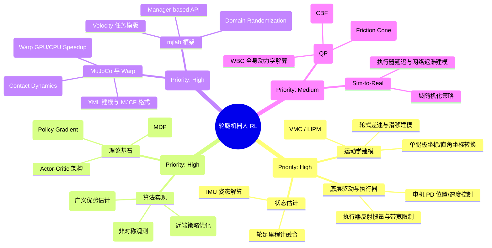
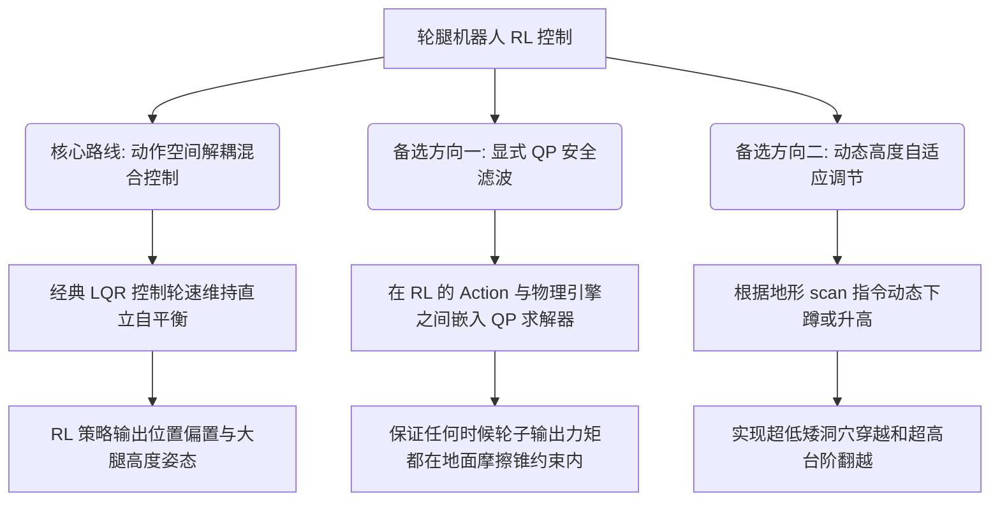

# Reinforcement Learning Control for a Wheel-Leg Robot in Isaac Lab (mjlab)
## Project Handbook, Learning Roadmap, and Research Guide

---

> **Project Name:** Reinforcement Learning Control for a Wheel-Leg Robot in Isaac Lab (mjlab)  
> **Student:** Zijie Zhang (UNNC FURP 2026)  
> **Timeline:** June 15, 2026 – August 15, 2026  
> **Framework:** `mjlab` (MuJoCo-Warp GPU/CPU Robot Learning Framework mimicking Isaac Lab's API)  

---

## 目录
1. [第一部分：项目整体认知 (Project Understanding)](#第一部分项目整体认知-project-understanding)
2. [第二部分：知识地图 (Knowledge Map)](#第二部分知识地图-knowledge-map)
3. [第三部分：先修知识与时间预算 (Prerequisites & Time Budget)](#第三部分先修知识与时间预算-prerequisites--time-budget)
4. [第四部分：暑期科研规划书 (Summer Research Plan)](#第四部分暑期科研规划书-summer-research-plan)
5. [第五部分：周度学习路线图 (Week-by-Week Roadmap)](#第五部分周度学习路线图-week-by-week-roadmap)
6. [第六部分：代码阅读指南 (Code Reading Guide)](#第六部分代码阅读指南-code-reading-guide)
7. [第七部分：学习资源库 (Learning Resources)](#第七部分学习资源库-learning-resources)
8. [第八部分：常见问题与解决方案 (Troubleshooting & Solutions)](#第八部分常见问题与解决方案-troubleshooting--solutions)
9. [第九部分：科研产出与创新规划 (Research Output & Innovation)](#第九部分科研产出与创新规划-research-output--innovation)

---

## 第一部分：项目整体认知 (Project Understanding)

### 1.1 研究背景与重大意义
**轮腿式机器人 (Wheel-legged Robot)** 结合了**足式机器人 (Legged Robot)** 的卓越越障能力与**轮式机器人 (Wheeled Robot)** 在平整路面上的高速度和高能效。它们是高度欠驱动、非线性且强耦合的动力学系统，能够实现诸如跳跃、俯仰自平衡、急停急转、高度主动调节以及劈叉等复杂的高动态行为。

传统的控制方法（如 Wbc 全身控制、MPC 模型预测控制、LQR 线性二次型调节器）依赖于高精度的动力学建模和复杂的在线二次规划 (QP) 求解。虽然这些方法具有理论上的安全界限，但它们在面对非结构化复杂地形（如碎石、台阶、倾斜面）或未建模摩擦力/轮滑移 (Wheel Slip) 时，表现出较差的鲁棒性。

**深度强化学习 (Deep Reinforcement Learning, DRL)** 通过在高度并发的物理仿真环境中进行数千万次的数据交互，能够端到端地学出极具鲁棒性的运动策略（Locomotion Policies）。近期的学术界研究（如 2024-2025 年腾讯 Robotics X 的 Ollie 机器人和 Diablo 开源平台）证明，将**高层强化学习策略（如速度跟踪、躯干高度与姿态调节）与底层模型控制（如关节 PD、QP 约束求解器）相结合的混合控制架构 (Hybrid Control)** 是当前高动态机器人控制的最前沿趋势。

### 1.2 FURP 2026 核心研究目标
本项目的研究目标是在 `mjlab` 仿真框架（高度复刻 NVIDIA Isaac Lab 的 Manager-based API，但使用 MuJoCo Warp 在 GPU/CPU 上实现极速的并行仿真）中，开发出一套能够实现轮腿机器人稳定平衡与全向移动的强化学习控制算法。

具体目标可细分为：
1. **机器人建模**：获取或构建目标轮腿机器人的 URDF/MJCF (MuJoCo XML) 模型，并定义其关节极限与物理特性。
2. **任务与环境设计**：在 `mjlab` 框架中基于 `VelocityEnvCfg` 架构设计轮腿机器人专属的观测空间 (Observations)、奖励函数 (Rewards)、动作空间 (Actions) 以及随机化扰动 (Domain Randomization)。
3. **策略训练与复现**：使用 `RSL-RL` 的 PPO (Proximal Policy Optimization) 算法进行训练，在本地进行 CPU 调试，在 GPU 服务器上进行大规模并行训练，实现全向速度指令跟踪。
4. **控制混合与优化 (10% 创新点)**：将 RL 输出的轮速及腿长位置指令与底层的自平衡/防滑移约束算法（例如 QP 二次规划）结合，对比纯端到端 RL 与混合控制的鲁棒性差异。

### 1.3 技术栈选择与架构图
本项目的软件核心是 **`mjlab`**。`mjlab` 是由学术界最新开源的高效机器人学习库，其 API 设计思想（基于 Manager 控制的解耦设计）与 NVIDIA **Isaac Lab** 保持高度一致。在 `mjlab` 中：
* `ObservationManager` 管理观测状态的获取和传感器噪声注入。
* `ActionManager` 管理动作的缩放、偏移和执行（如关节位置、速度或扭矩）。
* `RewardManager` 通过对任务跟踪和动作惩罚项进行加权，引导策略收敛。
* `TerminationManager` 控制回合的过早终止（如跌倒或越界）。

下面是本项目中轮腿机器人强化学习训练与执行的控制闭环流程图：

```mermaid
flowchart TB
    subgraph Command_Generator [指令生成器]
        Command[用户/虚拟速度指令: v_x, v_y, omega_z]
    end

    subgraph Policy_Network [RL 策略网络 - PPO]
        Actor[Actor Policy: Pi_theta]
        Critic[Critic Value: V_phi]
    end

    subgraph Environment_Managers [mjlab 环境管理器]
        ObsManager[Observation Manager]
        ActManager[Action Manager]
        RewManager[Reward Manager]
        TermManager[Termination Manager]
    end

    subgraph Low_Level_Control [底层控制层]
        QP[QP 约束求解器 / 关节 PD 控制]
    end

    subgraph Simulator [MuJoCo Warp 物理引擎]
        Robot[轮腿机器人实体]
        Terrain[随机地形 / 障碍物]
    end

    %% 数据流向
    Command -->|输入| Actor
    Command -->|输入| Critic
    
    ObsManager -->|Actor 观测项 (含噪声)| Actor
    ObsManager -->|Critic 观测项 (无噪声)| Critic
    
    Actor -->|目标动作: 腿部位置与轮速偏置| ActManager
    ActManager -->|动作缩放与安全滤波| QP
    QP -->|驱动力矩 / Target Pos| Robot
    
    Robot -->|物理状态更新| Simulator
    Terrain -->|碰撞与地形信息| Simulator
    
    Simulator -->|传感器数据 (IMU, 编码器, 测距)| ObsManager
    Simulator -->|接触力, 速度跟踪误差| RewManager
    Simulator -->|跌倒判定 (高度/姿态)| TermManager
    
    RewManager -->|反馈 Reward| Critic
```

---

## 第二部分：知识地图 (Knowledge Map)

为帮助从零开始的研究者系统地建立轮腿机器人强化学习控制的知识体系，以下将核心知识模块按优先级和依赖关系组织为知识地图：



---

## 第三部分：先修知识与时间预算 (Prerequisites & Time Budget)

下表列出了进入本项目所需的先修背景知识、推荐的学习材料以及建议的时间分配：

| 知识模块 | 掌握要求 (Priority) | 建议学习资料与路径 | 预计耗时 |
| :--- | :--- | :--- | :--- |
| **Python 与 PyTorch 基础** | **Must** | 《PyTorch 官方教程》、吴恩达《机器学习》编码作业。掌握张量运算、梯度传播和 MLP 的网络结构编写。 | 15 小时 |
| **马尔可夫决策过程与 PPO**| **Must** | OpenAI Spinning Up in Deep RL (极力推荐)。掌握 PPO 的 CLIP 目标函数原理，理解优势函数 (Advantage)。 | 20 小时 |
| **MuJoCo 物理仿真与 XML** | **Must** | [MuJoCo 官方文档](https://mujoco.readthedocs.io/)。学习如何通过 XML 描述机器人连杆、关节、接触和传动装置。 | 15 小时 |
| **mjlab / Isaac Lab 机制**| **Must** | 阅读 `mjlab` 源码中的 `envs/manager_based_rl_env.py` 和 `tasks/velocity_env_cfg.py`。理解 Step 和 Reset 中各 Manager 的工作流。 | 20 小时 |
| **Linux 系统与服务器训练** | **Should** | 掌握基本 Linux 命令 (`ssh`, `rsync`, `tmux`, `nvidia-smi`)。掌握使用虚拟环境工具 `uv` 的运行模式。 | 10 小时 |
| **刚体动力学与电机控制** | **Good-to-know** | 《机器人学导论》(Craig)。理解动力学中的雅可比矩阵 (Jacobian)、电机的扭矩-速度特性曲线。 | 15 小时 |
| **QP 控制与优化理论** | **Good-to-know** | 凸优化基础 (Boyd)。理解二次规划的矩阵形式和主动集法/内点法求解器的运行机制。 | 15 小时 |

---

## 第四部分：暑期科研规划书 (Summer Research Plan)

本项目为期两个月 (2026.06.15 - 2026.08.15)，整体科研规划分为 7 个关键阶段：

```
+---------------------------------------------------------------------------------------+
| 阶段 1 (1周) | 阶段 2 (1周) | 阶段 3 (1.5周) | 阶段 4 (1周) | 阶段 5 (1.5周) | 阶段 6 (1周) | 阶段 7 (1周)|
| 环境与代码   | 机器人物理   | 任务与环境     | 本地调试与   | 策略训练与     | 混合算法     | 总结汇报与  |
| 熟悉         | 建模导入     | 逻辑配置       | 服务器部署   | 调优评估       | (10%创新)    | 论文/报告  |
+---------------------------------------------------------------------------------------+
```

### 4.1 阶段详细规格说明

#### 阶段 1：环境与代码熟悉 (June 15 – June 20)
* **目标**：搭建本地 `mjlab` 开发环境，熟悉底层代码。
* **主要任务**：
  - 本地配置 CPU-only 版本的 `mjlab`。
  - 阅读 `mjlab` 中的 Cartpole 和 Go1 / G1 跟踪示例。
  - 跑通 Go1 随机策略的 Flat terrain 仿真，并拉起 `Viser` 网页端查看器进行交互。
* **面临风险与阻塞点**：Windows 环境下 C++ 编译器版本冲突。
* **解决策略**：使用 VS Community 开发工具包配置 MSVC，通过 `uv` 虚拟环境隔离依赖。
* **交付物**：本地成功运行 Go1 仿真的运行日志与第一周周报。

#### 阶段 2：机器人物理建模导入 (June 21 – June 28)
* **目标**：在 MuJoCo 中实现轮腿机器人模型的正确导入和运动学校验。
* **主要任务**：
  - 寻找或编写轮腿机器人的 URDF/XML 描述文件。轮腿机器人通常由一个浮动基座 (Floating Base)、两条两节或三节连杆的腿，以及安装在腿部末端的有源轮子组成。
  - 将 URDF 转换为 MuJoCo XML，并在 XML 中配置致动器（腿部使用 `position` 或 `torque` 致动器，轮子使用 `velocity` 或 `torque` 致动器）。
  - 编写一个简单的 Python 脚本，使用随机控制信号或正弦信号驱动关节，验证机器人在 MuJoCo Viewer 中是否会发生物理穿透或关节限位错误。
* **面临风险与阻塞点**：XML 中接触属性 (Contact parameters) 设置不合理，导致机器人高频抖动或异常飞天。
* **解决策略**：校对 `solref` 和 `solimp` 参数，为轮子和地面设置合理的摩擦系数 (Friction coefficient)。
* **交付物**：轮腿机器人编译通过的 MuJoCo XML 配置文件、随机动作测试的交互视频。

#### 阶段 3：任务与环境逻辑配置 (June 29 – July 7)
* **目标**：在 `mjlab` 中编写并注册轮腿机器人的强化学习环境。
* **主要任务**：
  - 创建 `tasks/velocity/config/wheel_leg` 文件夹，实现轮腿机器人的 `make_velocity_env_cfg` 配置函数。
  - 设计观测空间：除了常规基座 IMU 和关节角度外，轮腿机器人必须引入轮子的旋转速度。
  - 设计动作空间：决定网络是输出关节位置偏置（Leg Joint Position Offset）+ 轮子转速（Wheel Rolling Velocity），还是直接输出关节力矩（Torques）。**强烈建议第一阶段选用位置 + 速度混合输出**。
  - 编写特定的惩罚项，如腿部收缩限位、车身过度倾斜、轮子空转等。
* **面临风险与阻塞点**：轮腿机器人处于双轮站立平衡状态时是极度欠驱动的，动作缩放 (Action scale) 过大或过小都会导致训练初期直接跌倒。
* **解决策略**：参考平衡小车 LQR 参数，对轮速输出设置较小的动作缩放（例如 `scale = 0.2`），对腿部关节设置合理的位置限制。
* **交付物**：轮腿机器人专属的 `wheel_leg_env_cfg.py` 环境代码。

#### 阶段 4：本地调试与服务器部署 (July 8 – July 15)
* **目标**：跑通本地小批量训练流程，并将任务成功部署到 GPU 服务器。
* **主要任务**：
  - 在本地以小环境数量（如 `num_envs = 4`）在 CPU 模式下运行 PPO 训练，确保整个前向传播和反向更新的 Tensor 维度完全正确，无内存泄漏。
  - 将代码库推送到远程 GPU 服务器（Colab 或实验室服务器）。
  - 配置服务器端的 `uv` 虚拟环境，并使用 CUDA 加速运行大规模并行训练（如 `num_envs = 4096`），使用 `Weights & Biases` 或 `Tensorboard` 记录训练曲线。
* **面临风险与阻塞点**：本地 CPU 运行极其缓慢，服务器端由于缺少显示设备导致 OpenGL 渲染报错。
* **解决策略**：在服务器上启动训练时，将 viewer 配置关闭，或设置环境变量 `MUJOCO_GL=osmesa` 以启用无头模式 (Headless training)。
* **交付物**：远程 GPU 服务器上的训练脚本、Wandb 训练看板截图。

#### 阶段 5：策略训练与调优评估 (July 16 – July 25)
* **目标**：通过策略调整和超参数调优，获得能够在复杂地形上高速且稳定运动的策略。
* **主要任务**：
  - 运行完整的训练流程，目标是实现前向/后退 (0-1.5 m/s) 和转向 (0-1.0 rad/s) 指令的精确跟踪。
  - 引入地形课程学习 (Terrain Curriculum)，使机器人在平地稳定后，自动过度到包含斜坡、台阶和不平整碎石的地形上训练。
  - 进行消融实验 (Ablation Study)，对比有无动力学随机化（重心偏移、编码器偏置、接触摩擦力变化）训练出来的策略在面对外部扰动（如给车身施加瞬间推力）时的抗干扰能力。
* **面临风险与阻塞点**：策略陷入局部最优（例如：机器人为了不跌倒，选择原地滑行而不响应速度指令，或者通过高频抖动强行维持平衡）。
* **解决策略**：降低生存奖励的比重，适当提高速度跟踪奖励 `track_linear_velocity` 的权重；对关节输出变化率 `action_rate_l2` 施加惩罚以平滑控制指令。
* **交付物**：收敛的 RL 策略模型权重文件、速度跟踪曲线图。

#### 阶段 6：混合算法开发 (10% 创新点) (July 26 – August 5)
* **目标**：在动作空间中集成底层优化求解器，提升策略的稳定性和安全界限。
* **主要任务**：
  - **创新方案选择一：基于 QP 的安全滤波 (Safety Filter)**：RL 策略输出控制指令，在发送给 MuJoCo 之前，经过一个极小规模的二次规划 (QP) 求解器。该求解器以保护倾斜角不超限、轮子力矩不超过滑移临界值为约束，对 RL 的动作进行安全修正。
  - **创新方案选择二：残差学习 (Residual RL)**：底层使用传统平衡控制算法（如 LQR / 单级倒立摆 WBC）计算保持直立的基准力矩，RL 策略仅输出用于穿越障碍和拐弯所需的残差力矩（Residual Torque）。
  - 编写对比测试脚本，记录并在相同外部撞击/崎岖地形下，纯 RL 算法与混合算法的跌倒率（Failure Rate）。
* **面临风险与阻塞点**：在 Python 循环中在线求解 QP 导致仿真步频骤降。
* **解决策略**：使用极速的 C++ 绑定求解器或轻量级 Python 凸优化库 `qpsolvers` (配合 `OSQP` 求解器)，并控制求解维度。
* **交付物**：包含 QP 过滤层 / 残差控制器的 `hybrid_control_runner.py` 代码。

#### 阶段 7：总结汇报与论文/报告撰写 (August 6 – August 15)
* **目标**：整理实验数据，制作最终海报 (Poster) 并撰写结题技术报告。
* **主要任务**：
  - 录制机器人在复杂地形上越障、抗击推力扰动、高速行驶的精美渲染视频（利用网页 Viewer 的录屏或 MuJoCo 的渲染导出）。
  - 绘制关键图表：策略收敛曲线、在连续阶跃速度指令下的实际速度响应图、消融实验鲁棒性对比柱状图。
  - 撰写符合学术规范的研究技术报告（包括摘要、引言、相关工作、系统建模、RL 与混合控制器设计、实验验证及结论）。
  - 按照 UNNC FURP 要求，排版并输出最终展示海报 `FURP_Showcase.pdf`。
* **交付物**：科研技术报告 PDF 格式文档、展示 Poster 演示文件。

---

## 第五部分：周度学习路线图 (Week-by-Week Roadmap)

为确保研究者在漫长的暑期科研中保持专注，以下制定了精确到周的执行路径，包括每周的学习/开发任务和建议工时：

### 第 1 周：开发环境就绪与机制研读 (工时预算: 15h)
* **学习目标**：彻底理解 `mjlab` 的生命周期，复习强化学习 PPO。
* **具体任务**：
  - [x] 安装配置本地 `uv` 并重定向缓存，拉取 `mjlab-main` 安装 CPU 依赖包。
  - [x] 启动 `list-envs` 验证，测试运行 `Go1` 的 Flat 随机策略动作。
  - [ ] 阅读 OpenAI Spinning Up 的 [PPO 理论与实现部分](https://spinningup.openai.com/en/latest/algorithms/ppo.html)。
  - [ ] 详细阅读学长提供的双臂 QP+RL 仓库的 `README.md`，重点学习其如何在底层处理非holonomic（非完整约束）的运动控制。

### 第 2 周：轮腿机器人模型构建与导入 (工时预算: 20h)
* **学习目标**：在仿真中重构出物理正确的轮腿机器人。
* **具体任务**：
  - [ ] 寻找一个经典的轮腿机器人 URDF（如 Ascento, Ollie, 或者 Diablo）。
  - [ ] 转换为 MuJoCo XML 格式，将不必要的网格碰撞体简化为基本几何体（Box, Cylinder, Sphere）以加速仿真计算。
  - [ ] 将电机的扭矩限制、转子转动惯量（Rotor Inertia，对应 `yam_constants.py` 中的 `reflected_inertia`/`armature`）写入 XML 或对应的 constants 文件中。
  - [ ] 编写简单的测试脚本：施加关节力矩使车轮旋转，观察是否有阻尼或打滑。

### 第 3 周：强化学习环境与动作/观测定义 (工时预算: 20h)
* **学习目标**：基于 `make_velocity_env_cfg` 构建轮腿机器人的 MDP。
* **具体任务**：
  - [ ] 创建 `mjlab/tasks/velocity/config/wheel_legged_robot/` 并定义环境配置类。
  - [ ] **动作空间设计**：
    - 两侧大腿/膝盖关节（通常每侧2-3个自由度）采用 `JointPositionActionCfg`，输出位置变化量；
    - 两侧车轮采用速度驱动，动作输出的是目标转速差。
  - [ ] **观测空间设计**：
    - Actor 观测：IMU 姿态（Roll, Pitch）、基座角速度、腿部关节角度与速度、前一次动作指令、目标速度指令。
    - Critic 观测：除了包含 Actor 观测外，注入无噪声的基座线性速度（因为在实际机器人上基座线速度难以精确测量，但在仿真中 Critic 网络可以直接利用真值## 第九部分：科研产出与创新规划 (Research Output & Innovation)

### 9.1 科研创新点（满足 10% 增量创新要求）
作为本科生的科研实践，不仅要“复现”前人的论文，还需要加入至少 10% 的独立改进或创新。以下提供三个可行的创新技术方向，**在 `/grill-me` 讨论后，本项目已将“方向一”确定为核心技术路线**：



1. **核心技术路线：动作空间解耦混合控制 (LQR 车轮平衡 + RL 腿部协调) [SELECTED]**
   * *设计思路*：
     对于 Diablo 这种双轮足式机器人，维持前后方向俯仰角（Pitch）的自平衡是最底层的刚性需求。如果完全交给端到端 RL 从头探索，训练周期极长且极易频繁跌倒。我们在此对动作空间实施**解耦分级设计**：
     * **车轮自平衡 (LQR 控制器)**：基于机身 Pitch 角度及其角速度输入，通过经典线性二次型调节器 (LQR) 计算能够维持车体垂直平衡的车轮基准驱动转速：
       $$u_{lqr} = K_1 \cdot \theta_{pitch} + K_2 \cdot \dot{\theta}_{pitch} + K_3 \cdot v_{base} + K_4 \cdot (x_{base} - x_{target})$$
     * **大腿高度与滚动姿态 (RL 策略控制器)**：RL 策略网络不直接插手机身的微调自平衡。RL 网络只负责**高层协调动作**：控制左大腿、右大腿、左膝盖、右膝盖的关节位置（决定机器人的质心高度、俯仰倾角设定值以及横滚 Roll 轴姿态以适应斜坡）。
     * **融合机制**：实际施加给 Diablo 车轮的控制指令为：
       $$\text{Target\_Wheel\_Vel} = u_{lqr} + u_{rl\_bias}$$
       其中 $u_{rl\_bias}$ 是 RL 网络基于跟踪外部速度指令而输出给轮速的修正分量。
   * *价值*：该方案将自平衡的物理先验（Pitch 反馈）直接注入系统，将策略网络的搜索维度从全状态空间收缩至腿部协调空间，使算法收敛速度提升数倍，同时保证了机身不会发生不可逆的前倾/后仰摔倒，非常适合在为期两个月的暑期科研中快速复现并取得突破。
   * *在 `mjlab` 中的具体实现步骤*：
     1. 在 `envs/manager_based_rl_env.py` 的仿真步进循环 `step()` 中，在将 Action 作用到物理引擎前，计算当前环境的 Pitch 角真值。
     2. 根据 LQR 反馈公式计算出车轮的目标自平衡转速。
     3. 将 LQR 得到的转速与 `action_manager` 解析自 RL 网络输出的轮速偏差相加，得到最终控制信号下发给 MuJoCo。

2. **备选创新方向一：带防滑移摩擦锥约束的 QP 安全滤波（Safety Filter）**
   * *设计思路*：轮腿机器人在加速或越障时，若地面较滑，极易发生车轮打滑（Slip）。我们可以设计一个基于二次规划（QP）的保护层。当策略网络输出一个非常激进的轮速动作时，QP 过滤器结合估计的地面摩擦系数和车轮法向接触力，求解出一个最贴近 RL 输出但在摩擦力锥（Friction Cone）限制范围内的实际动作。
   * *价值*：在潮湿、结冰等地面的 sim-to-real 转换中，该方案将展现出压倒性的稳定性优势。

3. **备选创新方向二：面向地形越障的动态高度自适应控制**
   * *设计思路*：不仅要求机器人跟踪速度，还可以让指令生成器动态地给机器人下发“目标高度命令”（Height Commands）。结合 `foot_height_scan`（测距雷达），机器人能够学会在通过低矮空隙时收缩腿部下蹲，在跨越较高的台阶时主动抬腿迈步。
   * *价值*：将单一的自平衡移动任务扩展为了“三维避障和地形泛化”，极具视觉冲击力和科研深度。

### 9.2 最终技术报告 (Technical Report) 推荐大纲机的水平外力，迫使网络学会“小跑调整平衡”或“通过轮子前后来回滚动消减冲击力”。

### 第 6 周：PPO 算法超参数深度调优 (工时预算: 15h)
* **学习目标**：消除控制抖动，优化策略收敛质量。
* **具体任务**：
  - [ ] 针对轮腿机器人的高频抖动问题，调整 `action_rate_l2` 惩罚系数。
  - [ ] 优化超参数：尝试调节 PPO 的学习率（Learning Rate）、折扣因子（Gamma，如从 0.99 降到 0.98 以更关注当前直立状态）、广义优势估计因子（Lambda）。
  - [ ] 评估训练好的策略在不同摩擦力（Geom Friction 域随机化）地面下的适应力。

### 第 7 周：融合 QP 安全过滤层 (10% 创新) (工时预算: 25h)
* **学习目标**：开发混合控制器，给 RL 策略加上“安全护栏”。
* **具体任务**：
  - [ ] 建立轮腿机器人在简化的矢状面（Sagittal Plane）上的动力学方程（如轮式倒立摆模型）。
  - [ ] 编写二次规划 (QP) 求解器：
    - **优化目标**：最小化实际执行动作与 RL 策略推荐动作的偏差。
    - **约束条件**：防滑移约束（根据接触力约束轮子最大驱动扭矩）、机身防翻滚约束（限制最大 Pitch 倾角范围）。
  - [ ] 在 `step()` 循环中集成该 QP 安全过滤器，对比有无该过滤器时，强力推挤机器人下的跌倒概率。

### 第 8 周：数据收集与消融实验 (工时预算: 15h)
* **学习目标**：完成所有学术性的数据测试，准备图表。
* **具体任务**：
  - [ ] 运行测试脚本，在连续的阶跃速度指令下（例如在第 2 秒要求前向 1m/s，第 5 秒急停，第 8 秒后退 0.5m/s），记录机器人的实际速度追踪曲线。
  - [ ] 整理有无域随机化（Domain Randomization）、有无 QP 过滤器的消融实验曲线，并绘制成精美的图表。
  - [ ] 在 `mjlab` Viewer 中录制精美的高清运动视频。

### 第 9 周：技术报告撰写与答辩准备 (工时预算: 15h)
* **学习目标**：输出高质量的科研成果包。
* **具体任务**：
  - [ ] 撰写结题技术报告（Markdown 编写，随后转换为 PDF/Word）。
  - [ ] 按照学长仓库中海报的版式，制作本项目的科研展示海报。
  - [ ] 整理所有的 `src` 代码，编写规范的 `src/README.md` 说明，写明如何一键运行测试和复现训练。

---

## 第六部分：代码阅读指南 (Code Reading Guide)

在着手编写自己的配置前，必须深刻理解 `mjlab` 的底层运行机制。

### 6.1 核心环境基类：`envs/manager_based_rl_env.py`
在 `mjlab` 中，所有的 RL 交互都继承自 `ManagerBasedRlEnv`。请重点阅读其内部的 `step` 函数实现：

```python
def step(self, action):
    # 1. 动作管理器将 RL 神经网络输出的 [-1, 1] 的 Action 映射为物理动作 (如目标位置/速度)
    self.action_manager.process_action(action)
    
    # 2. 执行物理仿真步进 (Decimation 决定了仿真步和 RL 步的比例)
    for _ in range(self.cfg.decimation):
        # 施加控制输入到物理引擎
        self.sim.set_control(self.action_manager.compute_control())
        self.sim.step()
        # 更新传感器状态
        self.scene.update_sensors()
        
    # 3. 计算最新的观测状态，用于下一次策略前向传播
    obs = self.observation_manager.compute_observations()
    
    # 4. 计算奖励函数
    reward = self.reward_manager.compute_rewards()
    
    # 5. 检查回合是否终止 (跌倒、超时或出界)
    terminated, truncated = self.termination_manager.compute_terminations()
    
    return obs, reward, terminated, truncated, info
```

### 6.2 任务配置深度解析：`tasks/velocity/velocity_env_cfg.py`
在设计你的 `wheel_legged_env_cfg.py` 时，需要对以下三个核心 Manager 的参数进行定制：

#### A. 观测设计 (Observation Manager)
在轮腿机器人中，我们采用**非对称 Actor-Critic (Asymmetric Actor-Critic)** 架构。
* **Actor 观测**必须是机器人硬件上可以通过板载传感器（IMU、编码器）实时测量到的量：
  - 基座角速度 (`robot/imu_ang_vel`)：监测车身抖动与翻转趋势。
  - 重力投影 (`projected_gravity`)：策略能够感知自身的绝对倾斜姿态（Roll, Pitch）。
  - 关节角度与速度 (`joint_pos`, `joint_vel`)：感知大腿和膝盖的收缩状态。
  - 车轮转速 (`wheel_vel`)：【轮腿专属】判定车轮是在滚动还是空转。
  - 速度指令 (`command`)：网络需要知道目标的前向、侧向和转向速度。
* **Critic 观测**是在仿真训练时特有的“特权信息” (Privileged Information)，包含高精度的真值状态，以帮助 Critic 准确估计状态价值：
  - 绝对线速度 (`robot/imu_lin_vel` 真实值，无噪声)：极大地帮助基座速度跟踪奖励的收敛。
  - 接触力 (`foot_contact_forces`)：车轮与地面的法向和切向接触力，让 Critic 准确感知地面物理特性。

#### B. 动作设计 (Action Manager)
在 `actions` 字典中，通过 `ActionTermCfg` 指定驱动关节。
* **腿部关节 (Leg Joints)**：通常采用 `JointPositionActionCfg`。策略网络输出目标位置与标称初始姿态的偏差 $\Delta q_{pos}$。
  $$\text{Target Joint Pos} = q_{default} + \text{action} \times \text{scale}$$
  对轮腿机器人，为了防止腿部突然剧烈抽打导致倾覆，`scale` 应适当设小（例如 0.25 - 0.5）。
* **车轮关节 (Wheel Joints)**：可配置为速度控制模式。策略网络直接输出轮子的转速偏置（或直接输出驱动扭矩）。
  对于速度驱动轮：
  $$\text{Target Wheel Vel} = v_{target\_lin} / R_{wheel} \pm \omega_{target\_yaw} \cdot d_{base} / R_{wheel} + \text{action}_{wheel} \times \text{scale}_{wheel}$$

#### C. 奖励设计 (Reward Manager)
在 `rewards` 字典中，奖励函数的设计是引导机器人学会站立和响应指令的灵魂：

| 奖励项 ID | 物理意义 | 推荐权重 | 对轮腿机器人的设计建议 |
| :--- | :--- | :--- | :--- |
| `track_linear_velocity` | 响应前进/后退/横移指令 | 1.5 - 2.5 | 衡量是否能跟上目标车速，是移动的核心惩罚项。 |
| `track_angular_velocity`| 响应自转/转向指令 | 1.5 - 2.0 | 维持朝向跟踪，对于急弯平衡至关重要。 |
| `upright` | 保持基座直立（重力轴对齐）| 1.0 - 2.0 | **轮腿最核心奖励**。轮腿机器人必须维持俯仰角 (Pitch) 在 0 附近，否则会瞬间翻车。 |
| `pose` | 约束腿部默认高度姿态 | 0.5 - 1.0 | 惩罚过度劈叉或异常跪地，引导机器人保持标称高度。 |
| `dof_pos_limits` | 惩罚关节超限 | -1.0 - -2.0| 轮腿机器人在下蹲避障或起跳时，必须在机械死点前减速。 |
| `action_rate_l2` | 惩罚相邻步动作输出的剧烈跳变| -0.1 - -0.5| **降噪核心**。轮腿控制如果产生高频交流分量，电机容易过热烧毁。必须给动作变化率施加惩罚以获得平滑控制。 |
| `foot_slip` | 惩罚车轮在地面上的空转打滑 | -0.1 - -0.3| 【轮腿专属】在碎石或冰面上，若车轮线速度大幅偏离实际车速，施加惩罚。 |

---

## 第七部分：学习资源库 (Learning Resources)

以下精选了本项目最核心的文献、开源工具及线上代码库，并给出了实用性评分：

### 7.1 核心文献与教程

1. **OpenAI Spinning Up in Deep RL**  
   * **类型**：RL 入门必读教程与代码库。  
   * **评分**：⭐⭐⭐⭐⭐ (5/5)  
   * **链接**：[OpenAI Spinning Up 官方网站](https://spinningup.openai.com/)
   * **简介**：最友好的强化学习理论入门指南。重点阅读其关于 Policy Gradients、Actor-Critic 理论推导以及 PPO 的实现细节。
   
2. **"mjlab: A Lightweight Framework for GPU-Accelerated Robot Learning" (2025)**  
   * **类型**：本项目复现的核心论文。  
   * **评分**：⭐⭐⭐⭐⭐ (5/5)  
   * **链接**：[arXiv:2502.13963 论文页面](https://arxiv.org/abs/2502.13963)
   * **简介**：详细阐述了 `mjlab` 框架如何在保留 Isaac Lab 优秀的 Manager 机制的同时，通过 MuJoCo-Warp 实现了极低计算资源下的超高速并行仿真，是写报告时系统架构设计的理论来源。

3. **"Learning to Walk in Minutes using Massively Parallel Deep Reinforcement Learning" (Rudin et al., 2022)**  
   * **类型**：经典足式机器人 RL Locomotion 论文（RSL-RL 原理）。  
   * **评分**：⭐⭐⭐⭐⭐ (5/5)  
   * **链接**：[Science Robotics 论文页面](https://www.science.org/doi/10.1126/scirobotics.abk1375)
   * **简介**：奠定了目前并行强化学习训练机械狗运动策略的标准范式，其设计的一系列奖励函数（Air Time, Smoothness Penalty, Torque Penalty 等）被 `mjlab` 的 `velocity_env_cfg` 直接继承，是必须精读的开山之作。

4. **"First-principles-driven wheel-legged robot control via deep reinforcement learning" (2024)**  
   * **类型**：轮腿强化学习应用论文。  
   * **评分**：⭐⭐⭐⭐ (4/5)  
   * **简介**：详细介绍了如何设计轮腿机器人的奖励函数，特别是如何通过强化学习让机器人自主学会高度调节、跳跃以及在受到外力冲击时利用车轮的主动滚动实现动量平衡。

### 7.2 Diablo 机器人核心开源线上资源

1. **DDTRobot Official GitHub (Direct Drive Technology)**
   * **类型**：Diablo 官方软硬件生态库。
   * **评分**：⭐⭐⭐⭐⭐ (5/5)
   * **链接**：[Direct Drive Tech GitHub 主页](https://github.com/DDTRobot)
   * **简介**：Diablo 轮腿机器人的官方开发团队 GitHub，包含了核心 SDK 与仿真资源。

2. **Col_DIABLO_Issac_RL (Isaac Gym 训练实例)**
   * **类型**：Diablo 官方强化学习算法库。
   * **评分**：⭐⭐⭐⭐⭐ (5/5)
   * **链接**：[Col_DIABLO_Issac_RL GitHub 仓库](https://github.com/DDTRobot/Col_DIABLO_Issac_RL)
   * **简介**：**极其宝贵的参考资源！** 官方提供的基于 NVIDIA Isaac Gym 训练 Diablo 的项目。您可以直接参考其设计的 Observation 向量维度、Action 的物理映射方式以及具体的 Reward 权重，这与 `mjlab` 的配置可实现一比一的逻辑映射。

3. **diablo_ros2 (ROS2 硬件驱动层 SDK)**
   * **类型**：硬件控制核心库。
   * **评分**：⭐⭐⭐⭐ (4/5)
   * **链接**：[diablo_ros2 GitHub 仓库](https://github.com/DDTRobot/diablo_ros2)
   * **简介**：Diablo 机器人的官方 ROS2 SDK，详细记录了如何控制六个电机的关节位置、车轮速度，以及硬件端的数据通信格式。

4. **diablo_navigation (ROS 导航包)**
   * **类型**：社区导航应用。
   * **评分**：⭐⭐⭐⭐ (4/5)
   * **链接**：[diablo_navigation by Weston Robot 仓库](https://github.com/westonrobot/diablo_navigation)
   * **简介**：由 Weston Robot 维护 of Diablo ROS1 导航包，对后续做机器人的 SLAM 导航与路径规划研究非常有帮助。

5. **DiabloBipedWheeled_TorqueControl_ROS2 (力矩控制驱动)**
   * **类型**：第三方底层控制库。
   * **评分**：⭐⭐⭐⭐ (4/5)
   * **链接**：[Diablo Torque Control ROS2 仓库](https://github.com/dhruvkm2402/DiabloBipedWheeled_TorqueControl_ROS2)
   * **简介**：记录了如何绕过官方的位置控制环，直接在 ROS2 下对 Diablo 的 6 个电机进行直接力矩控制 (Direct Torque Control) 的底层探索。

---

## 第八部分：常见问题与解决方案 (Troubleshooting & Solutions)

### 8.1 本地无 NVIDIA GPU 时的开发与调试
* **问题描述**：本地只有集显（如 Intel Iris Xe），无法进行千万步级别的强化学习训练。
* **解决方案**：
  1. **本地做原型开发与语法校验**：在本地开发时，将 `num_envs` 设为 1 或 4，使用 CPU 模式进行单步调试。
     ```bash
     uv run --extra cpu python src/main.py --num_envs 4
     ```
     如果网络能够正常前向传播、仿真查看器（Viser）能够拉起，且没有报错，说明逻辑通过。
  2. **云端/服务器训练**：将调试通过的代码同步到 GPU 服务器上，运行大规模并行训练：
     ```bash
     # 服务器上通过无头模式运行
     export MUJOCO_GL=osmesa
     uv run python src/main.py --num_envs 2048 --headles
     ```

### 8.2 训练初期机器人频繁跌倒且不收敛
* **问题描述**：训练刚开始机器人就瞬间失去平衡摔倒在地，回合立即结束，网络学不到任何响应速度指令的信息。
* **解决方案**：
  1. **放宽初始姿态终止限制 (Termination parameters)**：将 `fell_over` 的 `limit_angle` 从 70 度稍微放宽，或者调高标称初始姿态的高度，给网络在摔倒前多留出几次尝试调整的机会。
  2. **增强直立奖励**：将 `upright` 奖励权重调高。
  3. **加入站立引导课程 (Standing Curriculum)**：在第一阶段的指令生成器中，将 `lin_vel_x` 和 `ang_vel_z` 的范围强制设为 0。先训练机器人学会“原地站立防倒”，待其能在平地稳定直立 10 秒以上后，再逐步放开速度指令让其学习移动。

### 8.3 策略训练出高频抖动的动作（Control Chattering）
* **问题描述**：机器人虽然能够跟踪速度且不摔倒，但腿部关节和车轮以极高频率反复振荡（表现为机身剧烈颤抖，Action 输出曲线呈高频锯齿状）。
* **解决方案**：
  1. **加大动作变化惩罚**：大幅提高 `action_rate_l2` 惩罚的绝对权重（例如从 -0.1 调大到 -0.5 或 -1.0）。
  2. **加入关节加速度与力矩惩罚**：引入对大腿关节角加速度的惩罚项（惩罚 $||q_{t} - 2q_{t-1} + q_{t-2}||_2^2$）。
  3. **降低 RL 执行频率**：增大 `decimation` 参数。如果物理步长是 `0.005s`，`decimation = 4` 代表 RL 控制决策步长是 `0.02s`（对应控制频率 50Hz）。如果动作仍然抖动，可以尝试将 `decimation` 改为 5 或 6（降低控制频率至 30~40Hz），从而自然过滤掉高频毛刺动作。

---

## 第九部分：科研产出与创新规划 (Research Output & Innovation)

### 9.1 科研创新点（满足 10% 增量创新要求）
作为本科生的科研实践，不仅要“复现”前人的论文，还需要加入至少 10% 的独立改进或创新。以下提供三个可行的创新技术方向：


1. **核心技术路线：动作空间解耦混合控制 (LQR 车轮平衡 + RL 腿部协调) [SELECTED]**
   * *设计思路*：
     对于 Diablo 这种双轮足式机器人，维持前后方向俯仰角（Pitch）的自平衡是最底层的刚性需求。如果完全交给端到端 RL 从头探索，训练周期极长且极易频繁跌倒。我们在此对动作空间实施**解耦分级设计**：
     * **车轮自平衡 (LQR 控制器)**：基于机身 Pitch 角度及其角速度输入，通过经典线性二次型调节器 (LQR) 计算能够维持车体垂直平衡的车轮基准驱动转速：
       $$u_{lqr} = K_1 \cdot \theta_{pitch} + K_2 \cdot \dot{\theta}_{pitch} + K_3 \cdot v_{base} + K_4 \cdot (x_{base} - x_{target})$$
     * **大腿高度与滚动姿态 (RL 策略控制器)**：RL 策略网络不直接插手机身的微调自平衡。RL 网络只负责**高层协调动作**：控制左大腿、右大腿、left_finger/right_finger 类似的高度、大腿关节位置（决定机器人的质心高度、俯仰倾角设定值以及横滚 Roll 轴姿态以适应斜坡）。
     * **融合机制**：实际施加给 Diablo 车轮的控制指令为：
       $$\text{Target\_Wheel\_Vel} = u_{lqr} + u_{rl\_bias}$$
       其中 $u_{rl\_bias}$ 是 RL 网络基于跟踪外部速度指令而输出给轮速的修正分量。
   * *价值*：该方案将自平衡的物理先验（Pitch 反馈）直接注入系统，将策略网络的搜索维度从全状态空间收缩至腿部协调空间，使算法收敛速度提升数倍，同时保证了机身不会发生不可逆的前倾/后仰摔倒，非常适合在为期两个月的暑期科研中快速复现并取得突破。
   * *在 `mjlab` 中的具体实现步骤*：
     1. 在 `envs/manager_based_rl_env.py` 的仿真步进循环 `step()` 中，在将 Action 作用到物理引擎前，计算当前环境的 Pitch 角真值。
     2. 根据 LQR 反馈公式计算出车轮的目标自平衡转速。
     3. 将 LQR 得到的转速与 `action_manager` 解析自 RL 网络输出的轮速偏差相加，得到最终控制信号下发给 MuJoCo。

2. **备选创新方向一：带防滑移摩擦锥约束的 QP 安全滤波（Safety Filter）**
   * *设计思路*：轮腿机器人在加速或越障时，若地面较滑，极易发生车轮打滑（Slip）。我们可以设计一个基于二次规划（QP）的保护层。当策略网络输出一个非常激进的轮速动作时，QP 过滤器结合估计的地面摩擦系数 and 车轮法向接触力，求解出一个最贴近 RL 输出但在摩擦力锥（Friction Cone）限制范围内的实际动作。
   * *价值*：在潮湿、结冰等地面的 sim-to-real 转换中，该方案将展现出压倒性的稳定性优势。

3. **备选创新方向二：面向地形越障的动态高度自适应控制**
   * *设计思路*：不仅要求机器人跟踪速度，还可以让指令生成器动态地给机器人下发“目标高度命令”（Height Commands）。结合 `foot_height_scan`（测距雷达），机器人能够学会在通过低矮空隙时收缩腿部下蹲，在跨越较高的台阶时主动抬腿迈步。
   * *价值*：将单一的自平衡移动任务扩展为了“三维避障和地形泛化”，极具视觉冲击力和科研深度。

### 9.2 最终技术报告 (Technical Report) 推荐大纲机的水平外力，迫使网络学会“小跑调整平衡”或“通过轮子前后来回滚动消减冲击力”。

### 第 6 周：PPO 算法超参数深度调优 (工时预算: 15h)
* **学习目标**：消除控制抖动，优化策略收敛质量。
* **具体任务**：
  - [ ] 针对轮腿机器人的高频抖动问题，调整 `action_rate_l2` 惩罚系数。
  - [ ] 优化超参数：尝试调节 PPO 的学习率（Learning Rate）、折扣因子（Gamma，如从 0.99 降到 0.98 以更关注当前直立状态）、广义优势估计因子（Lambda）。
  - [ ] 评估训练好的策略在不同摩擦力（Geom Friction 域随机化）地面下的适应力。

### 第 7 周：融合 QP 安全过滤层 (10% 创新) (工时预算: 25h)
* **学习目标**：开发混合控制器，给 RL 策略加上“安全护栏”。
* **具体任务**：
  - [ ] 建立轮腿机器人在简化的矢状面（Sagittal Plane）上的动力学方程（如轮式倒立摆模型）。
  - [ ] 编写二次规划 (QP) 求解器：
    - **优化目标**：最小化实际执行动作与 RL 策略推荐动作的偏差。
    - **约束条件**：防滑移约束（根据接触力约束轮子最大驱动扭矩）、机身防翻滚约束（限制最大 Pitch 倾角范围）。
  - [ ] 在 `step()` 循环中集成该 QP 安全过滤器，对比有无该过滤器时，强力推挤机器人下的跌倒概率。

### 第 8 周：数据收集与消融实验 (工时预算: 15h)
* **学习目标**：完成所有学术性的数据测试，准备图表。
* **具体任务**：
  - [ ] 运行测试脚本，在连续的阶跃速度指令下（例如在第 2 秒要求前向 1m/s，第 5 秒急停，第 8 秒后退 0.5m/s），记录机器人的实际速度追踪曲线。
  - [ ] 整理有无域随机化（Domain Randomization）、有无 QP 过滤器的消融实验曲线，并绘制成精美的图表。
  - [ ] 在 `mjlab` Viewer 中录制精美的高清运动视频。

### 第 9 周：技术报告撰写与答辩准备 (工时预算: 15h)
* **学习目标**：输出高质量的科研成果包。
* **具体任务**：
  - [ ] 撰写结题技术报告（Markdown 编写，随后转换为 PDF/Word）。
  - [ ] 按照学长仓库中海报的版式，制作本项目的科研展示海报。
  - [ ] 整理所有的 `src` 代码，编写规范的 `src/README.md` 说明，写明如何一键运行测试和复现训练。

---

## 第六部分：代码阅读指南 (Code Reading Guide)

在着手编写自己的配置前，必须深刻理解 `mjlab` 的底层运行机制。

### 6.1 核心环境基类：`envs/manager_based_rl_env.py`
在 `mjlab` 中，所有的 RL 交互都继承自 `ManagerBasedRlEnv`。请重点阅读其内部的 `step` 函数实现：

```python
def step(self, action):
    # 1. 动作管理器将 RL 神经网络输出的 [-1, 1] 的 Action 映射为物理动作 (如目标位置/速度)
    self.action_manager.process_action(action)
    
    # 2. 执行物理仿真步进 (Decimation 决定了仿真步和 RL 步的比例)
    for _ in range(self.cfg.decimation):
        # 施加控制输入到物理引擎
        self.sim.set_control(self.action_manager.compute_control())
        self.sim.step()
        # 更新传感器状态
        self.scene.update_sensors()
        
    # 3. 计算最新的观测状态，用于下一次策略前向传播
    obs = self.observation_manager.compute_observations()
    
    # 4. 计算奖励函数
    reward = self.reward_manager.compute_rewards()
    
    # 5. 检查回合是否终止 (跌倒、超时或出界)
    terminated, truncated = self.termination_manager.compute_terminations()
    
    return obs, reward, terminated, truncated, info
```

### 6.2 任务配置深度解析：`tasks/velocity/velocity_env_cfg.py`
在设计你的 `wheel_legged_env_cfg.py` 时，需要对以下三个核心 Manager 的参数进行定制：

#### A. 观测设计 (Observation Manager)
在轮腿机器人中，我们采用**非对称 Actor-Critic (Asymmetric Actor-Critic)** 架构。
* **Actor 观测**必须是机器人硬件上可以通过板载传感器（IMU、编码器）实时测量到的量：
  - 基座角速度 (`robot/imu_ang_vel`)：监测车身抖动与翻转趋势。
  - 重力投影 (`projected_gravity`)：策略能够感知自身的绝对倾斜姿态（Roll, Pitch）。
  - 关节角度与速度 (`joint_pos`, `joint_vel`)：感知大腿和膝盖的收缩状态。
  - 车轮转速 (`wheel_vel`)：【轮腿专属】判定车轮是在滚动还是空转。
  - 速度指令 (`command`)：网络需要知道目标的前向、侧向和转向速度。
* **Critic 观测**是在仿真训练时特有的“特权信息” (Privileged Information)，包含高精度的真值状态，以帮助 Critic 准确估计状态价值：
  - 绝对线速度 (`robot/imu_lin_vel` 真实值，无噪声)：极大地帮助基座速度跟踪奖励的收敛。
  - 接触力 (`foot_contact_forces`)：车轮与地面的法向和切向接触力，让 Critic 准确感知地面物理特性。

#### B. 动作设计 (Action Manager)
在 `actions` 字典中，通过 `ActionTermCfg` 指定驱动关节。
* **腿部关节 (Leg Joints)**：通常采用 `JointPositionActionCfg`。策略网络输出目标位置与标称初始姿态的偏差 $\Delta q_{pos}$。
  $$\text{Target Joint Pos} = q_{default} + \text{action} \times \text{scale}$$
  对轮腿机器人，为了防止腿部突然剧烈抽打导致倾覆，`scale` 应适当设小（例如 0.25 - 0.5）。
* **车轮关节 (Wheel Joints)**：可配置为速度控制模式。策略网络直接输出轮子的转速偏置（或直接输出驱动扭矩）。
  对于速度驱动轮：
  $$\text{Target Wheel Vel} = v_{target\_lin} / R_{wheel} \pm \omega_{target\_yaw} \cdot d_{base} / R_{wheel} + \text{action}_{wheel} \times \text{scale}_{wheel}$$

#### C. 奖励设计 (Reward Manager)
在 `rewards` 字典中，奖励函数的设计是引导机器人学会站立和响应指令的灵魂：

| 奖励项 ID | 物理意义 | 推荐权重 | 对轮腿机器人的设计建议 |
| :--- | :--- | :--- | :--- |
| `track_linear_velocity` | 响应前进/后退/横移指令 | 1.5 - 2.5 | 衡量是否能跟上目标车速，是移动的核心惩罚项。 |
| `track_angular_velocity`| 响应自转/转向指令 | 1.5 - 2.0 | 维持朝向跟踪，对于急弯平衡至关重要。 |
| `upright` | 保持基座直立（重力轴对齐）| 1.0 - 2.0 | **轮腿最核心奖励**。轮腿机器人必须维持俯仰角 (Pitch) 在 0 附近，否则会瞬间翻车。 |
| `pose` | 约束腿部默认高度姿态 | 0.5 - 1.0 | 惩罚过度劈叉或异常跪地，引导机器人保持标称高度。 |
| `dof_pos_limits` | 惩罚关节超限 | -1.0 - -2.0| 轮腿机器人在下蹲避障或起跳时，必须在机械死点前减速。 |
| `action_rate_l2` | 惩罚相邻步动作输出的剧烈跳变| -0.1 - -0.5| **降噪核心**。轮腿控制如果产生高频交流分量，电机容易过热烧毁。必须给动作变化率施加惩罚以获得平滑控制。 |
| `foot_slip` | 惩罚车轮在地面上的空转打滑 | -0.1 - -0.3| 【轮腿专属】在碎石或冰面上，若车轮线速度大幅偏离实际车速，施加惩罚。 |

---

## 第七部分：学习资源库 (Learning Resources)

以下精选了本项目最核心的文献、开源工具及线上代码库，并给出了实用性评分：

### 7.1 核心文献与教程

1. **OpenAI Spinning Up in Deep RL**  
   * **类型**：RL 入门必读教程与代码库。  
   * **评分**：⭐⭐⭐⭐⭐ (5/5)  
   * **链接**：[OpenAI Spinning Up 官方网站](https://spinningup.openai.com/)
   * **简介**：最友好的强化学习理论入门指南。重点阅读其关于 Policy Gradients、Actor-Critic 理论推导以及 PPO 的实现细节。
   
2. **"mjlab: A Lightweight Framework for GPU-Accelerated Robot Learning" (2025)**  
   * **类型**：本项目复现的核心论文。  
   * **评分**：⭐⭐⭐⭐⭐ (5/5)  
   * **链接**：[arXiv:2502.13963 论文页面](https://arxiv.org/abs/2502.13963)
   * **简介**：详细阐述了 `mjlab` 框架如何在保留 Isaac Lab 优秀的 Manager 机制的同时，通过 MuJoCo-Warp 实现了极低计算资源下的超高速并行仿真，是写报告时系统架构设计的理论来源。

3. **"Learning to Walk in Minutes using Massively Parallel Deep Reinforcement Learning" (Rudin et al., 2022)**  
   * **类型**：经典足式机器人 RL Locomotion 论文（RSL-RL 原理）。  
   * **评分**：⭐⭐⭐⭐⭐ (5/5)  
   * **链接**：[Science Robotics 论文页面](https://www.science.org/doi/10.1126/scirobotics.abk1375)
   * **简介**：奠定了目前并行强化学习训练机械狗运动策略的标准范式，其设计的一系列奖励函数（Air Time, Smoothness Penalty, Torque Penalty 等）被 `mjlab` 的 `velocity_env_cfg` 直接继承，是必须精读的开山之作。

4. **"First-principles-driven wheel-legged robot control via deep reinforcement learning" (2024)**  
   * **类型**：轮腿强化学习应用论文。  
   * **评分**：⭐⭐⭐⭐ (4/5)  
   * **简介**：详细介绍了如何设计轮腿机器人的奖励函数，特别是如何通过强化学习让机器人自主学会高度调节、跳跃以及在受到外力冲击时利用车轮的主动滚动实现动量平衡。

### 7.2 Diablo 机器人核心开源线上资源

1. **DDTRobot Official GitHub (Direct Drive Technology)**
   * **类型**：Diablo 官方软硬件生态库。
   * **评分**：⭐⭐⭐⭐⭐ (5/5)
   * **链接**：[Direct Drive Tech GitHub 主页](https://github.com/DDTRobot)
   * **简介**：Diablo 轮腿机器人的官方开发团队 GitHub，包含了核心 SDK 与仿真资源。

2. **Col_DIABLO_Issac_RL (Isaac Gym 训练实例)**
   * **类型**：Diablo 官方强化学习算法库。
   * **评分**：⭐⭐⭐⭐⭐ (5/5)
   * **链接**：[Col_DIABLO_Issac_RL GitHub 仓库](https://github.com/DDTRobot/Col_DIABLO_Issac_RL)
   * **简介**：**极其宝贵的参考资源！** 官方提供的基于 NVIDIA Isaac Gym 训练 Diablo 的项目。您可以直接参考其设计的 Observation 向量维度、Action 的物理映射方式以及具体的 Reward 权重，这与 `mjlab` 的配置可实现一比一的逻辑映射。

3. **diablo_ros2 (ROS2 硬件驱动层 SDK)**
   * **类型**：硬件控制核心库。
   * **评分**：⭐⭐⭐⭐ (4/5)
   * **链接**：[diablo_ros2 GitHub 仓库](https://github.com/DDTRobot/diablo_ros2)
   * **简介**：Diablo 机器人的官方 ROS2 SDK，详细记录了如何控制六个电机的关节位置、车轮速度，以及硬件端的数据通信格式。

4. **diablo_navigation (ROS 导航包)**
   * **类型**：社区导航应用。
   * **评分**：⭐⭐⭐⭐ (4/5)
   * **链接**：[diablo_navigation by Weston Robot 仓库](https://github.com/westonrobot/diablo_navigation)
   * **简介**：由 Weston Robot 维护 of Diablo ROS1 导航包，对后续做机器人的 SLAM 导航与路径规划研究非常有帮助。

5. **DiabloBipedWheeled_TorqueControl_ROS2 (力矩控制驱动)**
   * **类型**：第三方底层控制库。
   * **评分**：⭐⭐⭐⭐ (4/5)
   * **链接**：[Diablo Torque Control ROS2 仓库](https://github.com/dhruvkm2402/DiabloBipedWheeled_TorqueControl_ROS2)
   * **简介**：记录了如何绕过官方的位置控制环，直接在 ROS2 下对 Diablo 的 6 个电机进行直接力矩控制 (Direct Torque Control) 的底层探索。

---

## 第八部分：常见问题与解决方案 (Troubleshooting & Solutions)

### 8.1 本地无 NVIDIA GPU 时的开发与调试
* **问题描述**：本地只有集显（如 Intel Iris Xe），无法进行千万步级别的强化学习训练。
* **解决方案**：
  1. **本地做原型开发与语法校验**：在本地开发时，将 `num_envs` 设为 1 或 4，使用 CPU 模式进行单步调试。
     ```bash
     uv run --extra cpu python src/main.py --num_envs 4
     ```
     如果网络能够正常前向传播、仿真查看器（Viser）能够拉起，且没有报错，说明逻辑通过。
  2. **云端/服务器训练**：将调试通过的代码同步到 GPU 服务器上，运行大规模并行训练：
     ```bash
     # 服务器上通过无头模式运行
     export MUJOCO_GL=osmesa
     uv run python src/main.py --num_envs 2048 --headles
     ```

### 8.2 训练初期机器人频繁跌倒且不收敛
* **问题描述**：训练刚开始机器人就瞬间失去平衡摔倒在地，回合立即结束，网络学不到任何响应速度指令的信息。
* **解决方案**：
  1. **放宽初始姿态终止限制 (Termination parameters)**：将 `fell_over` 的 `limit_angle` 从 70 度稍微放宽，或者调高标称初始姿态的高度，给网络在摔倒前多留出几次尝试调整的机会。
  2. **增强直立奖励**：将 `upright` 奖励权重调高。
  3. **加入站立引导课程 (Standing Curriculum)**：在第一阶段的指令生成器中，将 `lin_vel_x` 和 `ang_vel_z` 的范围强制设为 0。先训练机器人学会“原地站立防倒”，待其能在平地稳定直立 10 秒以上后，再逐步放开速度指令让其学习移动。

### 8.3 策略训练出高频抖动的动作（Control Chattering）
* **问题描述**：机器人虽然能够跟踪速度且不摔倒，但腿部关节和车轮以极高频率反复振荡（表现为机身剧烈颤抖，Action 输出曲线呈高频锯齿状）。
* **解决方案**：
  1. **加大动作变化惩罚**：大幅提高 `action_rate_l2` 惩罚的绝对权重（例如从 -0.1 调大到 -0.5 或 -1.0）。
  2. **加入关节加速度与力矩惩罚**：引入对大腿关节角加速度的惩罚项（惩罚 $||q_{t} - 2q_{t-1} + q_{t-2}||_2^2$）。
  3. **降低 RL 执行频率**：增大 `decimation` 参数。如果物理步长是 `0.005s`，`decimation = 4` 代表 RL 控制决策步长是 `0.02s`（对应控制频率 50Hz）。如果动作仍然抖动，可以尝试将 `decimation` 改为 5 或 6（降低控制频率至 30~40Hz），从而自然过滤掉高频毛刺动作。

---

## 第九部分：科研产出与创新规划 (Research Output & Innovation)

### 9.1 科研创新点（满足 10% 增量创新要求）
作为本科生的科研实践，不仅要“复现”前人的论文，还需要加入至少 10% 的独立改进或创新。以下提供三个可行的创新技术方向：


1. **创新方向一：动作空间分级设计（RL + 传统平衡控制 LQR 融合）**
   * *设计思路*：纯端到端 RL 学轮腿直立往往很慢。我们可以将动作进行解耦：大腿位置关节由 RL 直接输出，用来调节机器人的躯干高度和俯仰姿态；而底层的车轮自平衡控制器使用经典的 LQR 或 PD（根据机身 Pitch 倾角实时反馈计算直立车轮扭矩）。RL 策略只需在这个直立扭矩的基础上叠加一个微调的偏置量（Bias）。
   * *价值*：能使策略收敛速度提升数倍，且极大地抑制了纯端到端控制容易产生的不稳定振荡。

2. **创新方向二：带防滑移摩擦锥约束的 QP 安全滤波（Safety Filter）**
   * *设计思路*：轮腿机器人在加速或越障时，若地面较滑，极易发生车轮打滑（Slip）。我们可以设计一个基于二次规划（QP）的保护层。当策略网络输出一个非常激进的轮速动作时，QP 过滤器结合估计的地面摩擦系数和车轮法向接触力，求解出一个最贴近 RL 输出但在摩擦力锥（Friction Cone）限制范围内的实际动作。
   * *价值*：在潮湿、结冰等地面的 sim-to-real 转换中，该方案将展现出压倒性的稳定性优势。

3. **创新方向三：面向地形越障的动态高度自适应控制**
   * *设计思路*：不仅要求机器人跟踪速度，还可以让指令生成器动态地给机器人下发“目标高度命令”（Height Commands）。结合 `foot_height_scan`（测距雷达），机器人能够学会在通过低矮空隙时收缩腿部下蹲，在跨越较高的台阶时主动抬腿迈步。
   * *价值*：将单一的自平衡移动任务扩展为了“三维避障和地形泛化”，极具视觉冲击力和科研深度。

### 9.2 最终技术报告 (Technical Report) 推荐大纲
完成项目后，你的结题技术报告应当包含以下部分：
* **1. Introduction (引言)**：阐述轮腿机器人的越障优势与控制难点，说明为什么选择强化学习与 `mjlab` 框架。
* **2. System Modeling & Simulation Setup (系统建模与仿真配置)**：介绍轮腿机器人的连杆长度、轮径、电机参数、在 MuJoCo 中的 XML 节点组织。
* **3. Methodology (控制算法设计)**：
  - 3.1 Markov Decision Process (MDP) 的数学定义。
  - 3.2 详细的 Observation, Action, Reward 设计矩阵。
  - 3.3 PPO 网络的结构与训练超参数列表。
  - 3.4 **创新点章节**：介绍你所实现的混合控制算法（如 QP 滤波或残差自平衡）。
* **4. Experiments & Ablation Studies (实验与消融实验)**：
  - 4.1 仿真环境中的平地与崎岖地形速度追踪表现分析。
  - 4.2 鲁棒性极限测试：承受瞬时冲击的推力极限，在低摩擦地面的通过率。
  - 4.3 消融实验：有无创新模块/有无动力学随机化的训练收敛曲线对比。
* **5. Conclusion & Future Work (结论与未来展望)**：总结暑期科研的重大成果，并展望如何在真实的轮腿机器人硬件平台上进行策略迁移。

---

> [!TIP]
> **本周首要任务清单**：
> 1. 阅读 [SEP-FURP-Mobile-Manipulator-2026/README.md](file:///d:/mjlab_workspace/SEP-FURP-Mobile-Manipulator-2026/README.md) 中关于底盘控制的物理描述，对比其四轮转向结构与你要实现的双轮腿结构在约束上的异同。
> 2. 尝试在 GitHub 上查找开源轮腿机器人的 `URDF` 描述文件，并使用 MuJoCo 将其转换为可读的 XML 文件。
